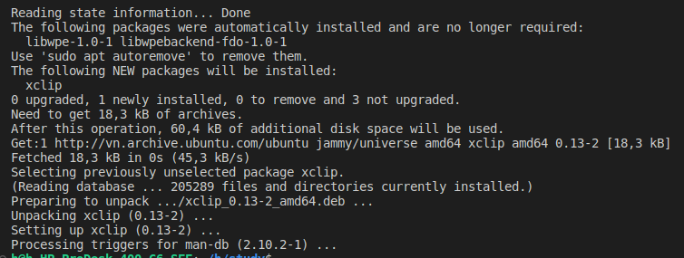

# Install VsCode
-   How to add "Open with Code" with right-click in Ubuntu or Pop OS?
```sh
wget -qO- https://raw.githubusercontent.com/cra0zy/code-nautilus/master/install.sh | bash
```

# Các lỗi thường gặp
## XClip Command 
- Lỗi: `You need to install xclip command first.` khi Ctrl + Alt + V paste image từ Clipboard
- Xử lý:
```sh
# Check
$ command -v xclip
$ echo $?
1

$ uptime | xclip
Command 'xclip' not found, but can be installed with:
sudo apt install xclip

# Install
sudo apt install -y xclip

```
- Check: `Ctrl + Alt + V`



- Kết quả: Ngon!